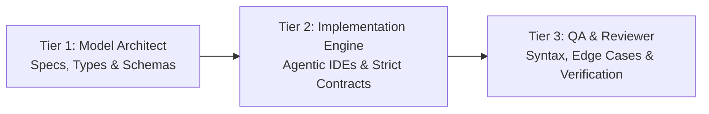

### Hi there 👋

# Francisco Manuel Fernández Martínez
**Full-Stack & Systems Developer | Cloud Infrastructure (Docker & Linux) | AI-Assisted Workflows**

 

---

### 📊 Performance & Development Metrics

<table align="center" width="100%">
  <tr>
    <td width="50%" align="center">
      
    </td>
    <td width="50%" align="center">
      
    </td>
  </tr>
</table>

---

### 🧠 Engineering Background & Infrastructure Philosophy

Titulado en **Sistemas Microinformáticos y Redes (SMR)** y actualmente cursando **Desarrollo de Aplicaciones Multiplataforma (DAM)**. Mi enfoque integra el rigor de la administración de sistemas y redes Linux con el diseño de software modular full-stack, arquitecturas concurrentes y pipelines aumentados por inteligencia artificial.

> 🔒 **Enterprise & Self-Hosted Note:** La mayor parte de las aplicaciones en producción se ejecutan en entornos privados / bare-metal (Home-Lab). Las métricas, diagramas de arquitectura interactivos y casos de estudio completos están disponibles públicamente en mi **[Portafolio Técnico](https://franfm.com/dev/index.html)**.

---

### 🏛️ Featured Architectures & Systems

<table width="100%">
  <tr>
    <td width="50%" valign="top">
      <h4>📱 <a href="https://franfm.com/dev/index.html">Pragma Core & Nutrition Ecosystem</a></h4>
      
Ecosistema móvil cross-platform con sincronización reactiva bidireccional, persistencia local SQLite (Offline-First), motor algorítmico de fatiga muscular en cliente y persistencia remota mediante Supabase.

      <code>React Native</code> • <code>TypeScript</code> • <code>SQLite</code> • <code>Supabase</code>
    </td>
    <td width="50%" valign="top">
      <h4>⚡ <a href="https://franfm.com/dev/index.html">High-Performance Media Bridge</a></h4>
      
Middleware concurrente de alto rendimiento para ingesta asíncrona, control de pipelines de streaming y generación automatizada de punteros <code>.strm</code> integrados con Jellyfin en contenedores Docker.

      <code>Go</code> • <code>Python</code> • <code>Docker</code> • <code>Jellyfin API</code>
    </td>
  </tr>
  <tr>
    <td width="50%" valign="top">
      <h4>👁️ <a href="https://franfm.com/dev/index.html">Multimodal Enterprise Engine</a></h4>
      
Backend contenerizado en Linux bare-metal con almacenamiento de objetos MinIO (S3), capa de caché en memoria con Redis, base de datos PostgreSQL e inferencia de visión/LLM vía OpenRouter (Qwen).

      <code>Node.js</code> • <code>PostgreSQL</code> • <code>Redis</code> • <code>MinIO S3</code> • <code>Qwen Vision</code>
    </td>
    <td width="50%" valign="top">
      <h4>🌐 <a href="https://franfm.com/dev/index.html">AutoBotIA Corporate Platform</a></h4>
      
Plataforma web empresarial desarrollada en Next.js con renderizado híbrido (SSR/SSG), optimizada para Core Web Vitals (>95/100) y con integración de agentes conversacionales mediante streaming API.

      <code>Next.js</code> • <code>React</code> • <code>Tailwind CSS</code> • <code>Agent APIs</code>
    </td>
  </tr>
</table>

---

### ⚙️ Triple-Tier Agentic Development Workflow

Metodología de ingeniería asistida por agentes basada en contratos estrictos y verificación formal:

1. **Model Architect:** Definición de especificaciones técnicas, tipado estricto en TypeScript, contratos de API REST/gRPC y modelado relacional antes de implementar.
2. **Code Implementation Engine:** Generación y refactorización guiada por contexto en entornos con agentes (Cursor, VS Code, Codex, Antigravity) vinculados mediante contratos de interfaces.
3. **QA & Reviewer Model:** Auditoría automatizada de sintaxis, mitigación de *edge-cases*, validación de dependencias y pruebas unitarias de regresión.
- **Protocol Interoperability:** Integración activa de herramientas y servidores **Model Context Protocol (MCP)** para introspección y manipulación directa de GitHub y bases de datos Supabase.

---

### 🛠️ Technology Stack

#### Frontend & Mobile

#### Backend & Storage

[-C72C48?style=flat-square&logo=minio&logoColor=white)](https://min.io/)

#### Infrastructure & DevOps

#### AI Tooling & Protocols
[-58A6FF?style=flat-square&logo=anthropic&logoColor=white)](https://modelcontextprotocol.io/)

---

  Diseñado con precisión técnica • Home-Lab Host & Cloud Architectures • © Francisco Manuel Fernández Martínez

